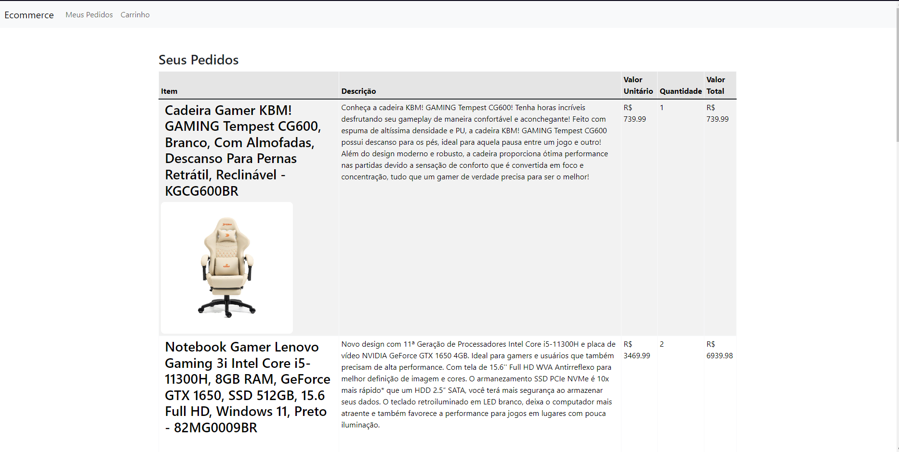

# GoCartAngular

Esse projeto foi criado seguindo o projeto [GoCart](https://github.com/VictorSantos09/GoCart), sendo dessa vez feito em Angular 17 para meios de prática com a framework.

### Nota
Certas simples implementações e funcionalidades não foram totalmente feitas da mesma forma ou não foram feitas, pois o objetivo desse projeto era focar na estrutura e na forma de se trabalhar com o Angular.


## Demonstração


## Funcionalidades

- Filtrar Produtos
- Adicionar ao Carrinho
- Remover do Carrinho
- Alterar Quantidade Desejada no Carrinho
- Efetuar Compra
- Visualizar Pedidos Realizados
- Visualizar Detalhes do Produto


## Rodando localmente

# Aviso

Precisa conter o angular CLI instalado, para mais informações visite [Angular Setup Local](https://angular.io/guide/setup-local)

Clone o projeto

```bash
  git clone https://github.com/VictorSantos09/GoCartAngular
```

Entre no diretório do projeto

```bash
  cd GoCartAngular
```

Instale as dependências

```bash
  npm install
```

Inicie o servidor

```bash
  npm run server
```

Inicie o front-end

```bash
  npm start
```


## Screenshots

Página Principal


Detalhes do Produto


Carrinho


Meus Pedidos


## Stack utilizada

**Front-end:** Angular 17, Boostrap, TypeScript, HTML, CSS

**Back-end:** NodeJS, JsonServer 

